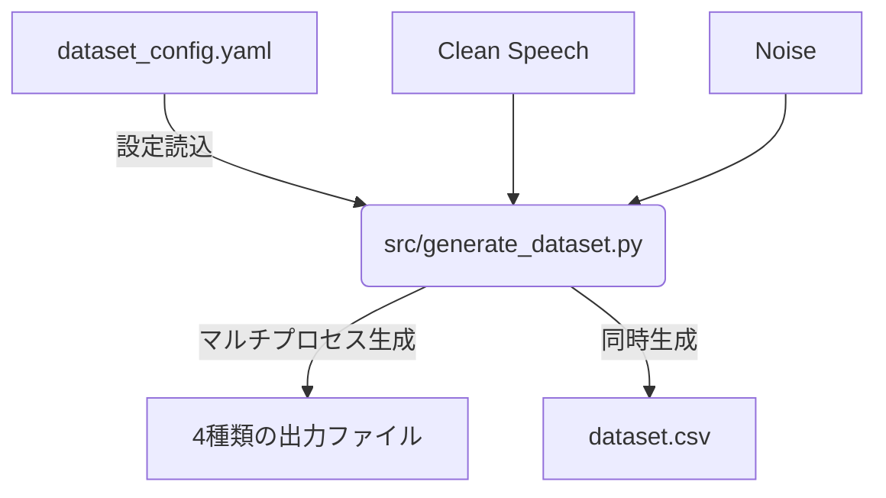

# PyRoomAcoustics Dataset Generator

## 概要

`pyroomacoustics` を用いた音響シミュレーションにより、機械学習（音源強調・分離など）用のデータセットを作成するリポジトリです。最新のアップデートにより、複雑だった複数スクリプトのフローが1つの設定ファイル（YAML）と実行スクリプトに統合され、さらにマルチプロセスでの高速化に対応しました。

指定した音声データと雑音データから、空間シミュレーション（Image Source Method）を用いて以下の4種類の波形データを同時に生成し、学習用のCSVインデックスまで自動で出力します。

1. **Clean**: 教師用の元の音声
2. **Noise Only**: 雑音ソースのみを含んだ音声
3. **Reverb Only**: 部屋の残響のみを含んだ音声
4. **Noise + Reverb**: 雑音と部屋の残響を両方含んだ音声

## 主な機能

*   **単一スクリプト化**: 従来のように「RIRの事前計算」と「合成」、「CSV出力」を別々に実行す​​る必要はありません。
*   **マルチプロセッシング**: CPUコアを最大限に活用し、シミュレーション処理にかかる膨大な時間を大幅に削減します。
*   **クリッピング防止**: 全ての出力ファイルを保存直前に最大振幅 `0.9` で自動ノーマライズし、音割れを防ぎます。
*   **絶対パス管理**: 入出力ディレクトリは `src/mymodule/const.py` にて一元管理。作業ディレクトリの場所に依存せずスクリプトを実行可能です。
*   **柔軟な設定**: 部屋の寸法、マイク位置、話者・雑音源の座標、SNR（ランダム範囲/固定）、残響時間（ランダム範囲/固定）のすべてを `dataset_config.yaml` 1つで自在にコントロールできます。

---

## ワークフロー (新アーキテクチャ)



## ディレクトリ構成

*   `config/`
    *   `dataset_config.yaml`: データ生成の挙動を決定するメイン設定ファイルです。
*   `src/`
    *   `generate_dataset.py`: データセット生成のメインスクリプトです。
    *   `mymodule/`: `const.py` (パスの定数定義) 等の共通ライブラリ。
*   `archive/`
    *   過去に使用されていた処理系のスクリプトやレガシーロジックのバックアップです（参考用）。

---

## 使い方

### ステップ 1: パスの確認
`src/mymodule/const.py` を開き、必要に応じて `SOUND_DATA_DIR` 等のルートパスがお使いの環境と合っているか確認・修正してください。

### ステップ 2: 設定ファイルの編集
`config/dataset_config.yaml` を目的に合わせて編集します。ここで指定する各種のディレクトリ（`speech_dir` 等）の起点は `const.py` の定数となっています。

### ステップ 3: スクリプトの実行
プロジェクトのルートディレクトリから、以下のコマンドを実行するだけでデータセットが生成されます。

```bash
# デフォルト設定 (config/dataset_config.yaml) を使用して実行
python src/generate_dataset.py

# または別の設定ファイルを指定して実行
python src/generate_dataset.py --config config/another_config.yaml
```

処理の進捗はターミナル上にプログレスバーで表示され、最終的にCSVファイルが出力フォルダに保存されたメッセージが出れば完了です。
