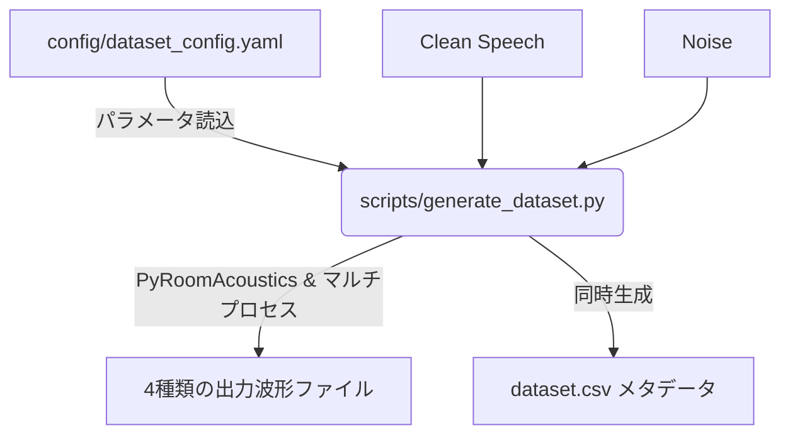

# PyRoomAcoustics Dataset Generator

## 概要

`pyroomacoustics` を用いた音響シミュレーションにより、機械学習（音源強調・分離など）用の学習データセットを自動生成するリポジトリです。
複雑だったスクリプトのフローが1つの設定ファイル（YAML）と実行スクリプトに統合され、マルチプロセスでの高速化に対応しています。

指定した音声データと雑音データから、空間シミュレーション（Image Source Method）を用いて以下の4種類の波形データを同時に生成し、管理用のCSVインデックスまで自動で出力します。

1. **Clean**: 教師信号となる元の綺麗な音声
2. **Noise Only**: 雑音ソースのみを含んだ音声
3. **Reverb Only**: 部屋の残響のみを含んだ音声
4. **Noise + Reverb**: 雑音と部屋の残響を両方含んだ音声

## 主な機能

*   **単一スクリプト化**: 「残響の計算」「合成」「CSV出力」を一つのスクリプトで一括処理します。
*   **マルチプロセッシング**: CPUコアを最大限に活用し、シミュレーション処理にかかる膨大な時間を大幅に削減します。
*   **クリッピング防止**: 全ての出力ファイルを保存直前に最大振幅 `0.9` で自動ノーマライズし、音割れを防ぎます。
*   **安全なパス管理 (dotenv)**: 環境変数ファイル `.env` を使用してベースディレクトリを指定し、`src/core/const.py` で内部パスを自動解決します。環境固有の絶対パスをGitの管理下に置かずに安全に実行可能です。
*   **柔軟な設定変更**: 部屋の寸法、マイク位置、話者・雑音源の座標、SNRや残響時間のランダム範囲など、すべて `dataset_config.yaml` 1つで自在にコントロール可能です。

---

## ワークフロー



## 設定の分離（3層構造）とディレクトリ構成

本リポジトリではコードの役割と設定が直感的にわかるよう、**3つのレイヤー**に分けて設定・状態を管理しています。（各Pythonファイルの先頭には役割を説明するコメントが記載されています）

*   **`.env` （環境固有ベースパス）**
    *   環境変数ファイル。Git管理外とし、ローカル固有の絶対ディレクトリパス（`SOUND_DATA_DIR` 等）を定義します。`.env_sample` をコピーして作成します。
*   **`config/` （実験パラメータ）**
    *   `dataset_config.yaml`: 使用する波形や部屋のサイズ、SNRなど、実験ごとに流動的な主要パラメータを1つのファイルで管理します（旧式の `dataset_v1.yml` 等は廃止されました）。
*   **`scripts/` （実行スクリプト）**
    *   `generate_dataset.py`: データセットを一括生成する**メインスクリプト**です。
    *   その他、RIR単体生成（`generate_rirs.py`）などの実行用スクリプト群が格納されています。
*   **`src/core/` （システム定数・裏側ライブラリ）**
    *   `const.py`: `.env` の値を利用し、プロジェクト内部の相対パスを解決・定義します。
    *   `dsp_params.py`: サンプリングレート(`SR`)やFFTサイズなど、変更の少ない信号処理定数を定義します。
    *   `rec_utility.py`, `audio.py`: 音響シミュレーション処理と音声ファイルI/O関連の共通処理を、責務ごとに分割した関数群です。

---

## 環境構築 (uvを使用)

本リポジトリは新しいPythonパッケージマネージャの **`uv`** を使用して依存関係を管理しています。

1. `uv` がインストールされていない場合は、公式ドキュメントに従って `uv` をインストールしてください。
2. リポジトリをクローン後、ターミナルで直下のディレクトリを開き以下のコマンドを実行します。
```bash
uv sync
```
これだけで `.venv` が作成され、必要なライブラリ（`pyroomacoustics`, `resampy`, `scipy` など）が全てインストールされます。

---

## 使い方 (メインスクリプトの実行)

### ステップ 1: 環境変数の設定（最重要）
プロジェクトのルートに存在する **`.env_sample`** をコピーし、**`.env`** という名前で保存してください。
作成した `.env` ファイルを開き、`SOUND_DATA_DIR` に**現在のPC環境の正しいデータ配置場所**（絶対パス：例 `D:/sound_data/`）を記述してください。
ここが間違っているとデータが読み込めずエラーになり、Gitにはコミットされません。

### ステップ 2: 設定ファイルの編集
`config/dataset_config.yaml` を目的に合わせて編集します。
ここで指定するディレクトリ名（`speech_dir` 等）の起点は、ステップ1で設定したベースパスとなります。

### ステップ 3: スクリプトの実行
プロジェクトのルートディレクトリで以下のコマンドを実行するだけでデータセットが生成されます。

```bash
# デフォルト設定 (config/dataset_config.yaml) を使用して実行
uv run python scripts/generate_dataset.py

# または別の設定ファイルを明示的に指定して実行
uv run python scripts/generate_dataset.py --config config/another_config.yaml
```

処理の進捗はターミナル上にプログレスバーで表示され、最終的にメタデータ用のCSVファイルが保存されたメッセージが出れば完了です。
