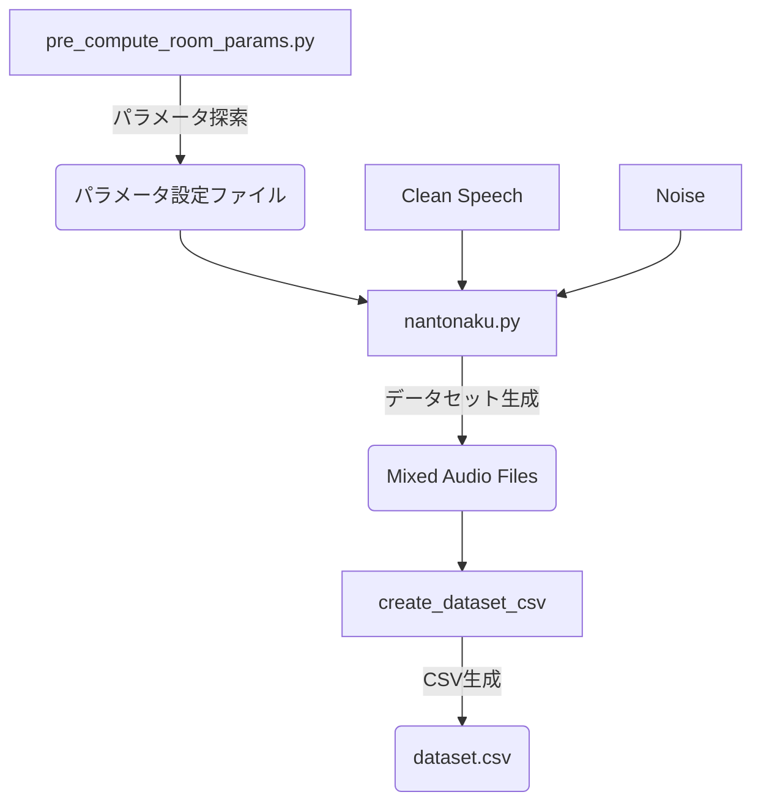

# PyRoomAcoustics Dataset Generator

## 概要

`pyroomacoustics` を用いた音響シミュレーションにより、機械学習（音源分離・強調など）用のデータセットを作成するリポジトリです。
`pyroomacoustics` の `inverse_sabine` 関数の誤差を考慮し、事前に正確なパラメータを探索してからデータセット生成を行うフローを採用しています。

## ワークフロー



## 必要なライブラリ

`requirements.txt` を参照してください。

```bash
pip install -r requirements.txt
pip install -e .
```

## 使い方

### ステップ 1: 部屋パラメータの探索

`pyroomacoustics.inverse_sabine` 関数には誤差があるため、目的の残響時間（RT60）になるようなパラメータ（吸音率など）を事前に探索します。

```bash
python scripts/pre_compute_room_params.py
```

  * **出力:** 正確なRT60を実現するためのパラメータ設定ファイルが出力されます（例: JSON形式など）。

### ステップ 2: データセットの生成

探索されたパラメータを用いて、実際に部屋のシミュレーションを行い、音声と雑音を畳み込んでデータセットを作成します。

```bash
python scripts/nantonaku.py
```

  * **入力:** ステップ1で求めたパラメータ、クリーン音声、雑音データ
  * **処理:** ランダムな部屋形状の生成、RIRの計算、畳み込み、SNR調整
  * **出力:** 残響・雑音付き音声ファイル（WAV）

### ステップ 3: 学習用CSVの作成

生成されたデータセットのファイルパスをまとめ、機械学習モデルの入力として使えるCSVファイルを生成します。

```bash
python scripts/create_dataset_csv.py
```

  * **出力:** データセットのパスやメタデータが記載されたCSVファイル（例: `dataset.csv`）

## ディレクトリ構成

  * `mymodule/`: 音響処理の共通ライブラリ
      * `rec_utility.py`: パラメータ探索 (`search_reverb_sec`)、シミュレーション、SNR調整などのコア機能
      * `my_func.py`: ファイル操作等のユーティリティ
  * `scripts/`: 実行用スクリプト
      * `pre_compute_room_params.py`: 部屋パラメータ探索スクリプト
      * `nantonaku.py`: データセット生成メインスクリプト
      * `create_dataset_csv`: CSV生成スクリプト（`create_audio_paths_csv.py` 相当）
  * `configs/`: 設定ファイル置き場
