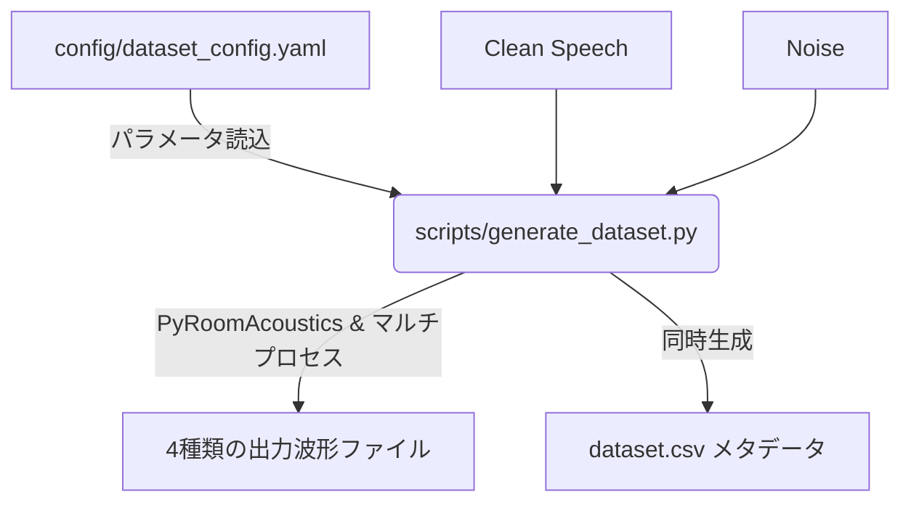

# PyRoomAcoustics Dataset Generator

## 概要

`pyroomacoustics` を用いた音響シミュレーションにより、機械学習（音源強調・分離など）用の学習データセットを自動生成するリポジトリです。
複雑だったスクリプトのフローが1つの設定ファイル（YAML）と実行スクリプトに統合され、マルチプロセスでの高速化に対応しています。

指定した音声データと雑音データから、空間シミュレーション（Image Source Method）を用いて以下の4種類の波形データを同時に生成し、管理用のCSVインデックスまで自動で出力します。

1. **Clean**: 教師信号となる元の綺麗な音声
2. **Noise Only**: 雑音ソースのみを含んだ音声
3. **Reverb Only**: 部屋の残響のみを含んだ音声
4. **Noise + Reverb**: 雑音と部屋の残響を両方含んだ音声

## 主な機能

*   **単一スクリプト化**: 「残響の計算」「合成」「CSV出力」を一つのスクリプトで一括処理します。
*   **マルチプロセッシング**: CPUコアを最大限に活用し、シミュレーション処理にかかる膨大な時間を大幅に削減します。
*   **クリッピング防止**: 全ての出力ファイルを保存直前に最大振幅 `0.9` で自動ノーマライズし、音割れを防ぎます。
*   **絶対パス管理**: 入出力のベースディレクトリは `src/core/const.py` にて一元管理されており、作業ディレクトリの場所に依存せず実行可能です。
*   **柔軟な設定変更**: 部屋の寸法、マイク位置、話者・雑音源の座標、SNRや残響時間のランダム範囲など、すべて `dataset_config.yaml` 1つで自在にコントロール可能です。

---

## ワークフロー



## ディレクトリ構成

引き継ぎにあたり、コードの役割が直感的にわかるよう整理されています。（各Pythonファイルの先頭には、そのプログラムの役割を説明するコメントが記載されています）

*   **`config/`**
    *   `dataset_config.yaml`: データ生成の挙動を決定するメイン設定ファイルです。
*   **`scripts/`**
    *   `generate_dataset.py`: データセットを一括生成する**メインスクリプト**です。
    *   その他、RIR単体生成（`generate_rirs.py`）や、部屋の可視化（`plot_room.py`）など、直接実行するための実用スクリプト群が格納されています。
*   **`src/core/`**
    *   `const.py`: ルートパスなどの**定数定義**。
    *   `utils.py`, `audio.py` など: シミュレーションやファイル操作、音響処理等を行う裏側の共通関数（ライブラリ）群です。

---

## 環境構築 (uvを使用)

本リポジトリは新しいPythonパッケージマネージャの **`uv`** を使用して依存関係を管理しています。

1. `uv` がインストールされていない場合は、公式ドキュメントに従って `uv` をインストールしてください。
2. リポジトリをクローン後、ターミナルで直下のディレクトリを開き以下のコマンドを実行します。
```bash
uv sync
```
これだけで `.venv` が作成され、必要なライブラリ（`pyroomacoustics`, `resampy`, `scipy` など）が全てインストールされます。

---

## 使い方 (メインスクリプトの実行)

### ステップ 1: パスの確認（最重要）
**`src/core/const.py`** を開き、`SOUND_DATA_DIR` のパスが **現在のPC環境の正しいデータ配置場所**（例: `D:/sound_data/` など）になっているかを確認・修正してください。
ここが間違っているとデータが読み込めずエラーになります。

### ステップ 2: 設定ファイルの編集
`config/dataset_config.yaml` を目的に合わせて編集します。
ここで指定するディレクトリ名（`speech_dir` 等）の起点は、ステップ1で設定したベースパスとなります。

### ステップ 3: スクリプトの実行
プロジェクトのルートディレクトリで以下のコマンドを実行するだけでデータセットが生成されます。

```bash
# デフォルト設定 (config/dataset_config.yaml) を使用して実行
uv run python scripts/generate_dataset.py

# または別の設定ファイルを明示的に指定して実行
uv run python scripts/generate_dataset.py --config config/another_config.yaml
```

処理の進捗はターミナル上にプログレスバーで表示され、最終的にメタデータ用のCSVファイルが保存されたメッセージが出れば完了です。
